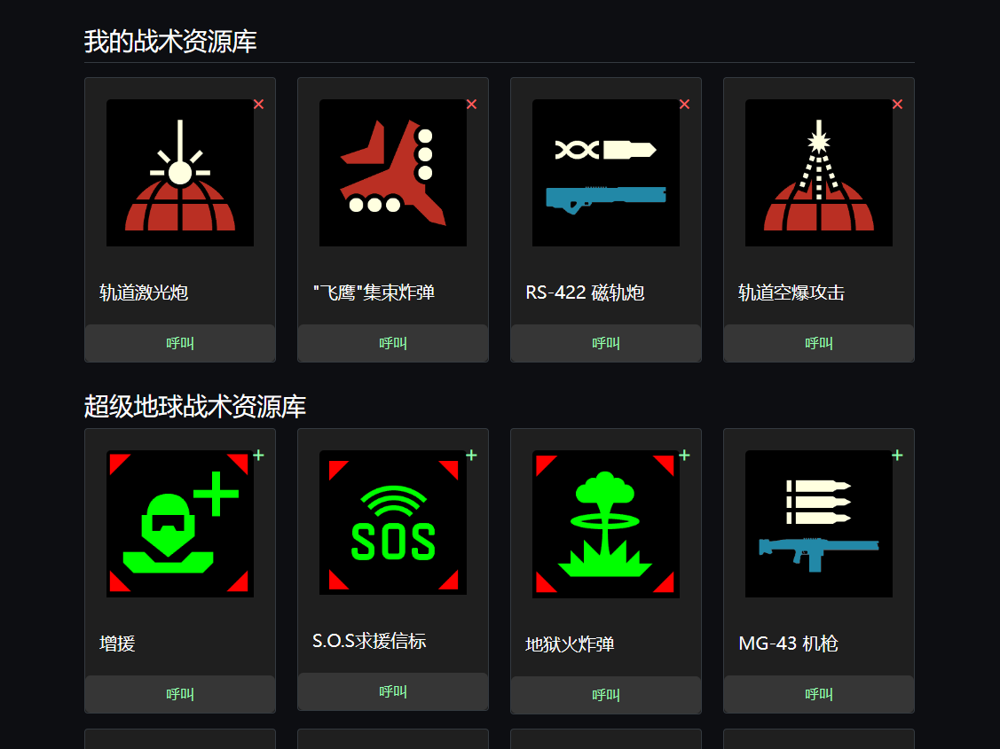

# Hell Diver 民主支援呼叫器

## 介绍

一个简单的 Web 程序, 用于在恶劣的战场中快速呼叫民主支援力量



在 PC 上启动服务后，可使用 手机/平板 访问 `http://{你的 PC 局域网 IP}:52380/` 来呼叫支援

## 使用方式 (EXE 运行)

> 注意: 应用不保证 100% 有效，在一些系统环境中可能需要反复重启应用多次才能生效，或者尝试使用源码运行，暂不明确原因，如有大佬愿帮助完善，欢迎 PR

通过 [Release](https://github.com/KroMiose/democratic-caller/releases/latest) 下载最新应用包解压以管理员权限运行 `DemocraticCaller.exe`

## 使用方式 (源码运行)

> 环境准备: [Python 3.10](https://www.python.org/downloads/release/python-3100/)

> 注意: 由于操作接口 API 需要管理员权限, 因此推荐先打开一个管理员终端并在其中进行下列流程

1. 克隆本仓库

```bash
git clone https://github.com/KroMiose/democratic-caller.git
cd democratic-caller
```

2. 安装 poetry

```bash
pip install poetry
```

3. 安装依赖

```bash
poetry install
```

4. 运行程序

```bash
poetry run app
```

## 打包成可执行文件

> 如果你不想每次都手动打开管理员终端再切到项目目录下运行，可以将其打包成可执行文件

```bash
poetry run build
```

打包后右键使用管理员权限运行 `dist/DemocraticCaller.exe` 即可
